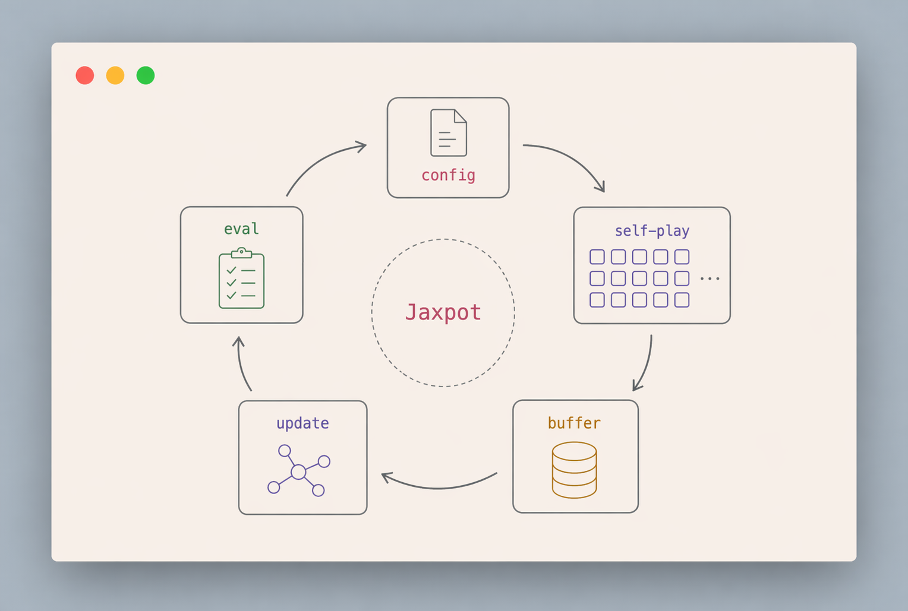
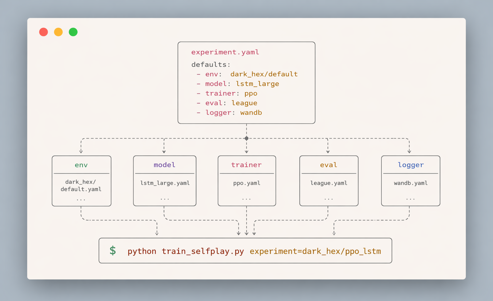
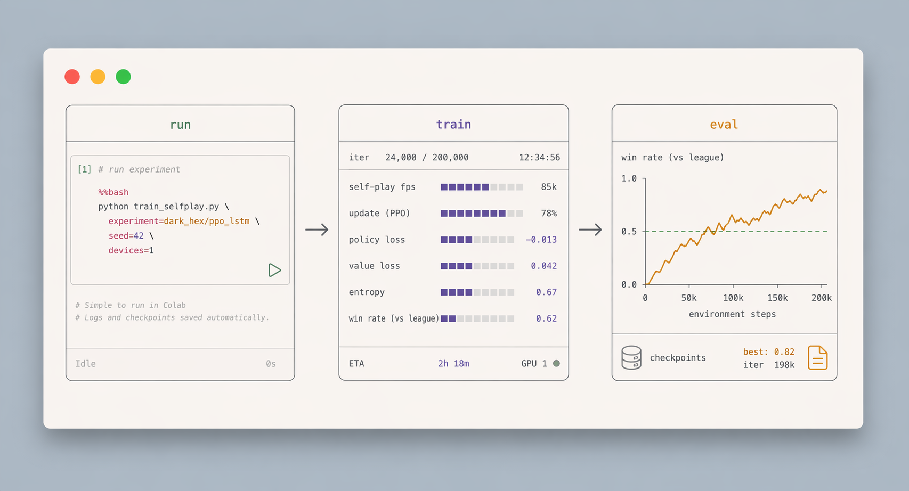

<div align="center">

# Jaxpot

*Scalable JAX self-play for `pgx` board games — PPO, league play, and rich evaluation out of the box.*


<video src="https://github.com/user-attachments/assets/1504fba1-f9f4-45a0-99d7-8c8078790911" autoplay muted loop playsinline width="780" poster="public/diagrams/jaxpot-concepts-overview-labeled-grid.png"></video>

</div>

Jaxpot is a reinforcement learning framework primarily focused on training for [pgx](https://github.com/sotetsuk/pgx)-based environments, using scalable distributed training with JAX. The repository includes configuration files for models (such as ResNet), environments, and training regimes (PPO), as well as support for multi-agent league play, baseline evaluation, and tools for experiment logging and reproducibility.

## Installation

Jaxpot targets Python 3.12 and is easiest to run with [uv](https://docs.astral.sh/uv/):

```bash
uv sync
```

All commands below use `uv run ...` so they execute inside the project's managed environment.

## Quickstart

For a first test, run a built-in config for just a few iterations:

```bash
uv run python train_selfplay.py experiment=go_9x9/go_9_config env=go/9x9 logger=none total_iters=3
```

If you want local visualizations without creating a Weights & Biases account, use TensorBoard instead:

```bash
uv run python train_selfplay.py experiment=go_9x9/go_9_config env=go/9x9 logger=tensorboard total_iters=3
uv run tensorboard --logdir outputs
```

If TensorBoard only shows the `HPARAMS` tab and not `Scalars`, restart TensorBoard after the training run has begun writing event files.

## Tutorial: Add a new environment and train PPO on it

This walkthrough adds **Tic-Tac-Toe** as a new environment and trains a small MLP with PPO self-play. It is the recommended starting point if you have never used Jaxpot before.

Jaxpot uses [Hydra](https://hydra.cc/) for configuration. A training run is assembled by composing four kinds of YAML files:

<p align="center">
  
</p>


| File                                   | What it picks                                                                    |
| -------------------------------------- | -------------------------------------------------------------------------------- |
| `config/env/<name>.yaml`               | The environment class (a `pgx.core.Env`).                                        |
| `config/model/<name>.yaml`             | The neural network architecture.                                                 |
| `config/trainer/<name>.yaml`           | The RL algorithm (e.g. `ppo`).                                                   |
| `config/eval/<name>.yaml`              | The evaluator(s) used during training.                                           |
| `config/experiment/<game>/<name>.yaml` | The top-level experiment that overrides the four above and sets hyperparameters. |


You only need to write **one** new file in each category — Hydra defaults take care of the rest.

---

## 1. Add the environment

Tic-Tac-Toe ships with `pgx`, so the env config is one line. Create `config/env/tic_tac_toe/default.yaml`:

```yaml
_target_: pgx.tic_tac_toe.TicTacToe
```

> Adding a different game? Any class that implements `[pgx.core.Env](https://github.com/sotetsuk/pgx)` works. To use a custom env, drop the file under `src/jaxpot/env/` and point `_target_` at its import path.

## 2. Add the model

Tic-Tac-Toe observations have shape `(3, 3, 2)` → flattened input dim `18`, with `9` discrete actions. A tiny MLP is more than enough. Create `config/model/tic_tac_toe_mlp.yaml`:

```yaml
_target_: jaxpot.models.architectures.mlp.MLPModel
hidden_dims: [64, 64]
```

## 3. Add the experiment config
<p align="center">
  
</p>

Create `config/experiment/tic_tac_toe/fast.yaml`. This is the only file that ties everything together and sets training hyperparameters:

```yaml
# @package _global_

defaults:
  - override /logger: none           # set to `wandb` / `tensorboard` / `multi` if you want logging
  - override /model: tic_tac_toe_mlp
  - override /trainer: ppo
  - override /env: tic_tac_toe/default
  - override /eval: random           # evaluate vs a random opponent
  - _self_

tags: ["tic_tac_toe"]
experiment_name: "tic_tac_toe_selfplay"

trainer:
  batch_size: 1024
  auxiliary_losses: []
  clip_eps: 0.2
  entropy_decay_iterations: 2_000

seed: 42
lr: 3e-4
lr_schedule: "constant"
multi_gpu: false
use_target_selfplay: false
selfplay_num_envs: 1024
random_num_envs: 512
league_num_envs: 0
archive_num_envs: 0
random_warmup_iters: 0
league_add_every: 0
base_unit: 64
num_steps: 16
total_iters: 2_000
grad_accum_steps: 1
gamma: 0.99
gae_lambda: 0.95

max_grad_norm: 1.0
save_every: 200
keep_last_k: 3
best_checkpoint_top_k: 3
resume_from: null
```

## 4. Run training

From the project root:

```bash
uv run python train_selfplay.py experiment=tic_tac_toe/fast logger=none
```

That's it. You should see PPO self-play iterations printed to the console, and (because `eval: random` is selected) a periodic win-rate against a random opponent. Tic-Tac-Toe is small enough to converge in a few minutes on CPU.

## 5. Find outputs and checkpoints

Hydra writes each run under `outputs/...`. Checkpoints are stored in that run directory under `checkpoints/`.

If you want local dashboards, the TensorBoard logger writes to `outputs/.../tensorboard/`.

There is also a standalone evaluation helper:

```bash
python scripts/eval_checkpoint.py /path/to/checkpoint --num-envs 1024 --num-steps 16 --seed 42
```

## Recap — files you created

```
config/env/tic_tac_toe/default.yaml
config/model/tic_tac_toe_mlp.yaml
config/experiment/tic_tac_toe/fast.yaml
```

To adapt this to a different `pgx` game, copy the three files, change the `_target_` of the env, update `obs_shape` / `action_dim` in the model to match the new env's `observation_shape` and `num_actions`, and bump `num_steps`, `selfplay_num_envs`, and `total_iters` for larger games.

## Example Results Dark Hex 7x7

<p align="center">
  
</p>

Self-play PPO checkpoints rated by round-robin Elo and win-rate vs random. See [`scripts/plot_dark_hex_training_charts.py`](scripts/plot_dark_hex_training_charts.py) for the plotting code and [`visualizations/article_charts/`](visualizations/article_charts/) for the underlying JSON.

## Documentation

For longer walkthroughs and reference material, see [docs/](docs/):

- [docs/modules.md](docs/modules.md) - module layout: main loop, evaluators, rollouts, models, trainers, and losses.
- [docs/custom_env.md](docs/custom_env.md) - writing a custom `pgx` environment and training on it.
- [docs/go_evaluation.md](docs/go_evaluation.md) - round-robin Gomill + BayesElo workflow for rating Go engines such as KataGo, Pachi, and Jaxpot checkpoints.

## License

This project is licensed under the MIT License. See [LICENSE](LICENSE) for the full text.
