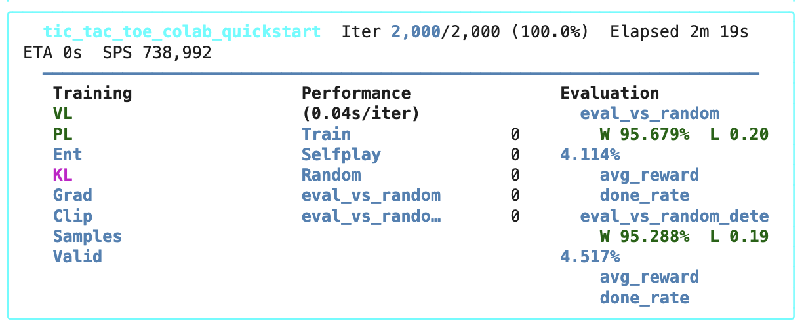
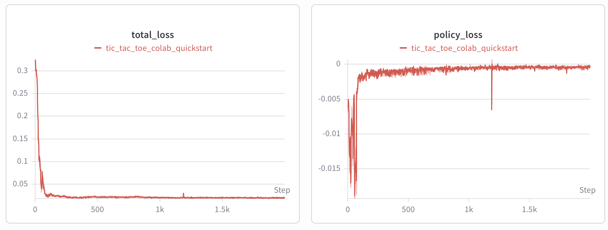
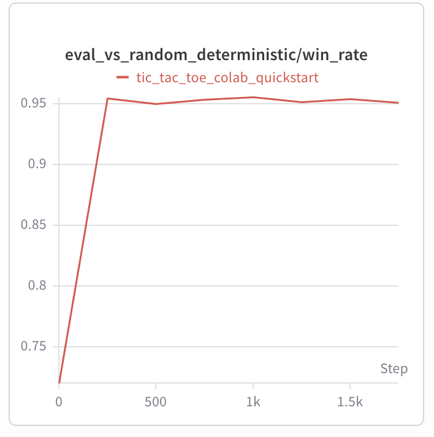

# Train Self-Play RL Agents Fast 🏎️ With Jaxpot

In this post, we will do:

1. Run a Tic-Tac-Toe self-play experiment in Colab.
2. Inspect the learning curves with TensorBoard, with W&B as an optional cloud dashboard.
3. Turn the same training stack toward a more interesting imperfect-information game: Dark Hex.

The point is not that Tic-Tac-Toe is hard. The point is that after the first run works, we will switch to different game without rewriting the RL system.

This is where [Jaxpot](https://github.com/bards-ai/Jaxpot) gets interesting.

Jaxpot is a JAX-based reinforcement learning framework for 1v1 games. It is built around `pgx`-style environments, Hydra configuration, PPO and AlphaZero-style training components, self-play, league play, baseline evaluation, checkpointing, and experiment logging.

---

## Why Another RL Library?

There are many excellent RL libraries. The reason Jaxpot is worth looking at is more specific: it is designed for fast, reproducible self-play experiments in two-player games.

Single-agent RL already has enough moving parts. In two-player games, the training target is moving. Your agent is not learning against a fixed dataset or a fixed simulator. It is learning against versions of itself, random opponents, archived policies, heuristic baselines, or known game-theoretic targets.

For imperfect-information games, it gets even spicier. The agent may not see the true state of the game. It sees an information state: its cards, its dice, its own stones, public actions, failed guesses, or revealed cells. Evaluation is also less obvious. "The reward went up" is not always convincing when your opponent is co-evolving with you.

Jaxpot's useful abstraction is this:

```text
Game environment
    -> vectorized rollout collection
    -> advantage / target computation
    -> PPO or AlphaZero-style training
    -> evaluators
    -> checkpoints
    -> TensorBoard / W&B
```

The game changes. The training pipeline stays recognizable.

That is a very good trade if you want to explore many games quickly.

---

## What Jaxpot Gives You

At a high level, Jaxpot provides:

- JAX-native environments through `pgx` or custom `pgx.core.Env` implementations.
- PPO training for policy/value agents.
- AlphaZero-style components for search-based agents.
- Self-play rollouts compiled with JAX.
- League and archive play, so agents can train against older opponents instead of only their latest self.
- Evaluators against random agents, baselines, archived policies, and small-game Nash exploitability.
- Hydra configs for experiments, models, environments, trainers, and loggers.
- TensorBoard and Weights & Biases logging.
- Checkpointing through Orbax.

The configuration system is the quiet hero here. A Jaxpot training run is assembled from small YAML files:


| Config                  | Responsibility                                 |
| ----------------------- | ---------------------------------------------- |
| `config/env/...`        | Which game environment to use                  |
| `config/model/...`      | Which neural network architecture to use       |
| `config/trainer/...`    | Which RL optimizer/trainer to use              |
| `config/eval/...`       | Which opponents or metrics to evaluate against |
| `config/experiment/...` | The complete recipe for one run                |


That makes the workflow feel closer to running experiments than editing scripts.

---

## Why It Is A Good Fit For Imperfect-Information Games

Perfect-information games are games like Chess, Go, Connect Four, and standard Hex: both players can see the full game state.

Imperfect-information games hide something. Poker hides cards. Liar's Dice hides dice. Phantom Tic-Tac-Toe hides opponent marks. Dark Hex hides opponent stones unless you collide with them.

Jaxpot already includes several environments in this direction:

- Liar's Dice: private dice plus public bids.
- Kuhn Poker and Leduc Hold'em: small poker games where exploitability can be measured.
- Phantom Tic-Tac-Toe: Tic-Tac-Toe with hidden opponent moves.
- Dark Hex: Hex where you only see your own stones and cells revealed by failed moves.

The architectural pieces that matter for this class of games are:

- Observations can be player-specific, not just the raw board.
- Action history can be added when the default observation aliases different information states.
- Recurrent models can be used when memory matters.
- Self-play and league play reduce overfitting to a single opponent.
- Small poker games can be evaluated with Nash exploitability, not just win rate.

This is not magic. You still need to design the environment, choose the observation, and interpret the metrics carefully. But the framework gives you the hooks where those decisions belong.

---

## Quick Start: Tic-Tac-Toe In Colab

The fastest way to touch the library is the companion Colab notebook:

```text
notebooks/tic_tac_toe_colab_quickstart.ipynb
```

In the published repo this notebook should be linked near the top of the README, ideally with an "Open in Colab" badge.

The notebook does four things:

1. Clones Jaxpot.
2. Installs dependencies with `uv`.
3. Creates a tiny Tic-Tac-Toe experiment config.
4. Runs PPO self-play and opens TensorBoard.

The Tic-Tac-Toe environment:

```yaml
_target_: pgx.tic_tac_toe.TicTacToe
```

The model config is also small:

```yaml
_target_: jaxpot.models.architectures.mlp.MLPModel
hidden_dims: [64, 64]
```

Jaxpot reads the environment's observation shape and action count at startup, then injects those into the model. That is why the model config does not need to hard-code "3x3 board" or "9 actions".

The experiment config is where the run becomes concrete:

```yaml
# @package _global_

defaults:
  - override /logger: tensorboard
  - override /model: tic_tac_toe_mlp
  - override /trainer: ppo
  - override /env: tic_tac_toe/default
  - override /eval: random
  - _self_

tags: ["tic_tac_toe", "colab", "quickstart"]
experiment_name: "tic_tac_toe_colab_quickstart"

trainer:
  num_epochs: 2
  batch_size: 1024
  auxiliary_losses: []

selfplay_num_envs: 1024
random_num_envs: 512
league_num_envs: 0
archive_num_envs: 0
num_steps: 16
total_iters: 200
```

You can notice now why Jaxpot makes sense:

```text
same training script + different Hydra config = different experiment
```

---

## Reading The Training Output

When the run starts, Jaxpot prints a TUI dashboard.



The dashboard is useful while the run is active, but curves are better for understanding training. You should see something like this after the run:





The no-account path is TensorBoard:

```bash
uv run tensorboard --logdir outputs
```

In Colab, the notebook uses:

```python
%load_ext tensorboard
%tensorboard --logdir outputs
```

One small gotcha: if TensorBoard only shows `HPARAMS` and not `Scalars`, restart TensorBoard after the training run has started writing event files. This is not a Jaxpot issue; TensorBoard sometimes needs a fresh process to pick up new scalar data.

The curves worth checking first are:

- policy loss: is the policy still changing?
- value loss: is the value head learning to predict outcomes?
- entropy: is the policy still exploring or collapsing too early?
- KL: are PPO updates staying in a reasonable range?
- evaluation win rate: is the policy improving against the configured opponent?
- samples/sec: is the run using your hardware effectively?

If you want a cloud dashboard, Jaxpot also supports Weights & Biases.

For this article, there is a public project:

```text
https://wandb.ai/team-bards-ai/Jaxpot%20Public
```

However, W&B currently requires users to be logged in or to provide an API key before uploading runs. Public means anyone can view. It does not mean anonymous readers can always write runs without credentials.

So the practical recommendation is:

- Use TensorBoard as the plug-and-play default.
- Use W&B when you want a shareable cloud dashboard.

If you are logged in to W&B, the command is:

```bash
uv run wandb login
uv run python train_selfplay.py experiment=tic_tac_toe/colab logger=wandb_public
```

That sends the run to the public Jaxpot project.

---

## From Toy Game To Real Game: Dark Hex

Tic-Tac-Toe proves the pipeline works. Now let's switch to a game that is still small enough to understand, but much more interesting.

Dark Hex is an imperfect-information version of Hex.

In normal Hex, both players see the whole board. In Dark Hex, each player sees:

- empty cells according to their own view
- their own stones
- opponent stones only when revealed through failed placement attempts

The true board exists, but the agent does not get to see it.

This is a much better demonstration of why environment design matters. The agent is not just choosing a move from a board. It is acting under uncertainty.

Jaxpot already includes the Dark Hex environment:

```text
src/jaxpot/env/dark_hex/
```

And the environment configs:

```text
config/env/dark_hex/classical.yaml
config/env/dark_hex/abrupt.yaml
```

The classical version works like this:

- if you choose an empty cell, you place your stone and the turn passes
- if you choose an occupied cell, the cell is revealed and you try again

The abrupt version is harsher:

- if you choose an occupied cell, the cell is revealed and you lose the turn

That one rule changes the information economics of the game. A failed move is no longer just information; it is information plus tempo loss.

---

## Creating A Dark Hex Experiment

To train on Dark Hex, we do not need a new training loop. We need an experiment config.

Create:

```text
config/experiment/dark_hex/fast.yaml
```

With:

```yaml
# @package _global_

defaults:
  - override /logger: tensorboard
  - override /model: mlp
  - override /trainer: ppo
  - override /env: dark_hex/classical
  - override /eval: random
  - _self_

tags: ["dark_hex", "imperfect_information", "quickstart"]
experiment_name: "dark_hex_fast"

trainer:
  num_epochs: 2
  batch_size: 1024
  auxiliary_losses: []
  clip_eps: 0.2
  entropy_coeff: 0.01
  entropy_coeff_start: 0.05
  entropy_decay_iterations: 500

model:
  hidden_dims: [128, 128]

seed: 42
lr: 3e-4
lr_schedule: "constant"
multi_gpu: false
use_target_selfplay: false

selfplay_num_envs: 1024
random_num_envs: 512
league_num_envs: 0
archive_num_envs: 0
random_warmup_iters: 0
league_add_every: 0
base_unit: 64
num_steps: 32
total_iters: 500
grad_accum_steps: 1
gamma: 0.99
gae_lambda: 0.95

max_grad_norm: 1.0
save_every: 100
keep_last_k: 3
best_checkpoint_top_k: 3
resume_from: null

eval:
  - _target_: jaxpot.evaluator.random.RandomEvaluator
    eval_every: 50
    num_envs: 1024
    num_steps: ${num_steps}
    deterministic: false
    name: eval_vs_random
  - _target_: jaxpot.evaluator.random.RandomEvaluator
    eval_every: 50
    num_envs: 1024
    num_steps: ${num_steps}
    deterministic: true
    name: eval_vs_random_deterministic
```

Then run:

```bash
uv run python train_selfplay.py experiment=dark_hex/fast
```

For a smoke test, reduce the iteration count:

```bash
uv run python train_selfplay.py experiment=dark_hex/fast total_iters=10
```

For the abrupt variant, swap the env:

```bash
uv run python train_selfplay.py experiment=dark_hex/fast env=dark_hex/abrupt
```

That is the moment where the framework starts to pay off. We changed the game dynamics with a config override.

No new rollout code.

No new trainer.

No new logger.

Just a different experiment.

---

## What You Need To Add Your Own Game

There are two paths.

The easy path is to use an existing `pgx` environment. That is what the Tic-Tac-Toe example does.

The custom path is to implement a `pgx.core.Env`. That is what Dark Hex does.

A custom Jaxpot-compatible environment needs:

- `_init(key)`: create the initial state
- `_step(state, action, key)`: apply one action
- `_observe(state, player_id)`: return what this player is allowed to see
- `legal_action_mask`: tell the agent which moves are available
- `rewards`: return zero-sum rewards at terminal states
- `terminated` / `truncated`: stop episodes cleanly

For imperfect-information games, `_observe` is where the design lives.

You usually do not want to expose the true state. You want to expose the information state: what the acting player knows at that moment.

In Dark Hex, the true board contains both players' stones. But the observation has only three channels:

```text
empty cells in my view
my stones
opponent stones revealed by failed attempts
```

That is the whole point. The hidden state exists, but the policy cannot cheat.

Once the environment exists, the rest is configuration:

```text
config/env/my_game/default.yaml
config/model/my_model.yaml
config/experiment/my_game/fast.yaml
```

If the game is small, start with an MLP. If the observation is spatial and larger, try a convolutional or ResNet-style model. If the game depends heavily on memory, reach for recurrent models.

And start small. The first run should answer one question:

```text
Does the full training loop execute?
```

Only after that should you scale environment counts, rollout length, model size, league play, and total iterations.

---

## What I Like About This Workflow

The best thing about Jaxpot is not that it hides RL complexity.

It does not.

You still need to understand the game, rewards, observations, evaluation, and compute budget.

The best thing is that it puts the complexity in the right places.

Game rules live in the environment.

Architecture lives in the model config.

Training behavior lives in the experiment config.

Metrics go to TensorBoard or W&B.

Checkpoints go under the run directory.

That separation is what makes the system usable for experimentation. A researcher can compare game variants. A software engineer can reproduce a run. A CTO can look at a project and see whether the team is building reusable infrastructure or a museum of one-off notebooks.

For me, that is the real test of an RL framework.

Not "can it solve the toy problem?"

But:

```text
Can I run the toy problem, understand the result, and then move to the real problem without starting over?
```

Jaxpot is built for that second question.

---

## Practical Checklist

If you want to try it:

1. Open the Tic-Tac-Toe Colab notebook.
2. Run the notebook top to bottom.
3. Confirm TensorBoard shows scalar curves.
4. Try the same run with `logger=wandb_public` if you use W&B.
5. Add the Dark Hex experiment config.
6. Run `total_iters=10` as a smoke test.
7. Scale only after the smoke test works.

For a tiny first run:

```bash
uv run python train_selfplay.py experiment=tic_tac_toe/colab
```

For the advanced example:

```bash
uv run python train_selfplay.py experiment=dark_hex/fast total_iters=10
```

That is enough to get from "I cloned the repo" to "I trained a self-play agent on an imperfect-information game."

The interesting work starts after that.